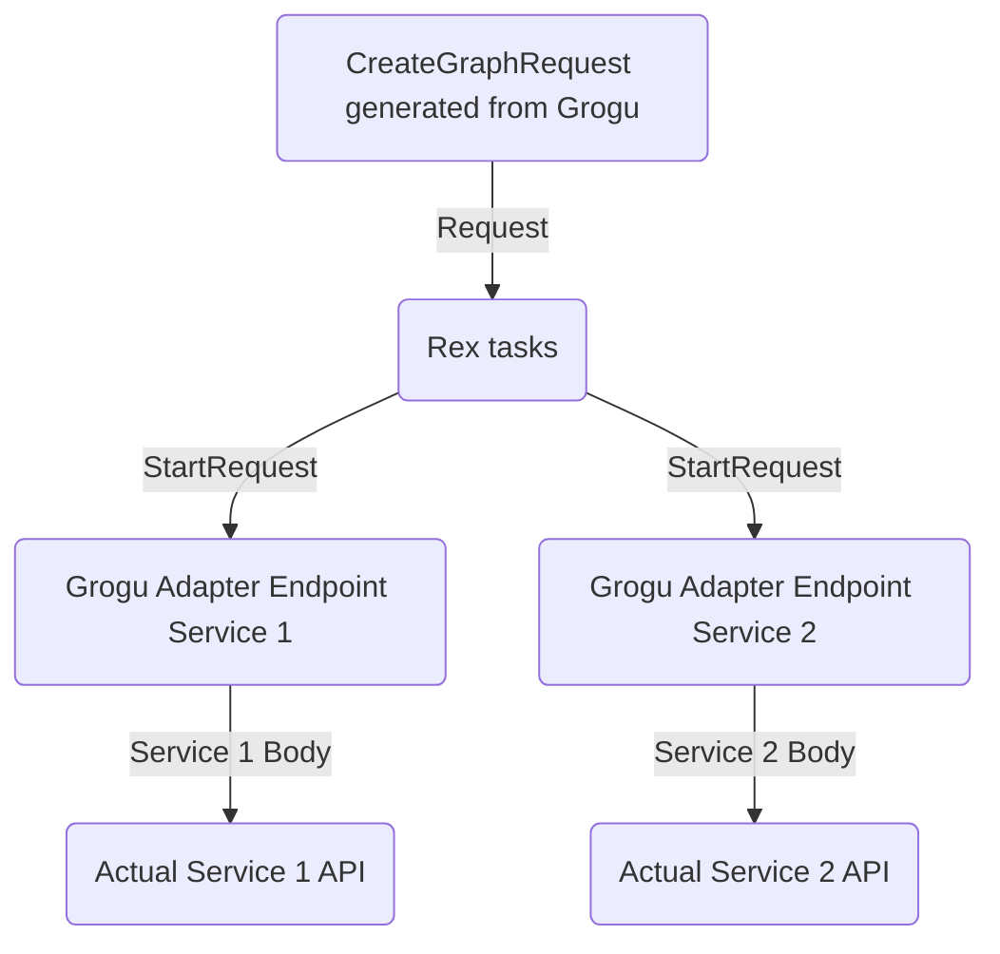

# dingrogu

The application configures workflows to run on [Rex](https://github.com/project-ncl/rex). A particular workflow can consists of multiple Rex tasks interlinked together.

We want to have workflows for:
- repository creation (talking with [Repour](https://github.com/project-ncl/repour))
- milestone release
- build process
- deliverables analyzer

# Architecture
This application consists of 2 parts:
- The creation of the workflow to send to Rex
- An adapter part that translates Rex's `StartRequest` and `StopRequest` DTOs to the specific application, as well as handling of callbacks from the applications back to Rex

The adapter part is necessary to decouple Rex's particular DTO requests with the specific downstream's
application API.

The project is configured to build a uber-jar by default.

## Endpoints
Workflow Management
```
/workflow/<name>/start
/workflow/<name>/cancel/<id>
```

Adapter Management
```
/adapter/<application>/start
/adapter/<application>/callback/<id>
```

As for the ids, we need to pick one that will allow the adapter to link the request to the Rex task.

## Workflow Creation
Rex requires that we specify for each task:
- an endpoint to start the request and its payload
- and endpoint to cancel the request and its payload
- mdc values

Rex then sends to the endpoint the `StartRequest` DTO which contains:
- positiveCallback
- negativeCallback
- payload
- mdc map
- taskResults map (in case a task needs the result of a dependant task)

# Rex Tutorial
When creating the tasks to send to Rex, we'll create a graph request containing tasks, and the dependencies between tasks.

The task uses the `Request` DTO to tell Rex:
- which service it needs to send the request
- the payload and headers and HTTP method

The `Request` we define in the graph request gets transformed into:
- `StartRequest`
- `StopRequest`

by Rex before sending the data to the service. The `Request` attachment becomes the `StartRequest` payload.



## Future Rex features to explore
- Unique queue per workflow to have QoS and its own queue size
- Atomic running of group of tasks; if there's a failure, the group of tasks are run again
- Query Rex for the current state of affairs to get previous run data

## Running the application in dev mode

You can run your application in dev mode that enables live coding using:
```shell script
./mvnw compile quarkus:dev
```

> **_NOTE:_**  Quarkus now ships with a Dev UI, which is available in dev mode only at http://localhost:8080/q/dev/.

## Packaging and running the application

The application can be packaged using:
```shell script
./mvnw package
```

## Creating a native executable

You can create a native executable using: 
```shell script
./mvnw package -Pnative
```

Or, if you don't have GraalVM installed, you can run the native executable build in a container using: 
```shell script
./mvnw package -Pnative -Dquarkus.native.container-build=true
```

You can then execute your native executable with: `./target/dingrogu-1.0.0-SNAPSHOT-runner`

If you want to learn more about building native executables, please consult https://quarkus.io/guides/maven-tooling.

# House Rules

- We only use Jackson for JSON serialization
- Lombok usage is allowed
- Syncing happens in the PNC Devs Slack channel