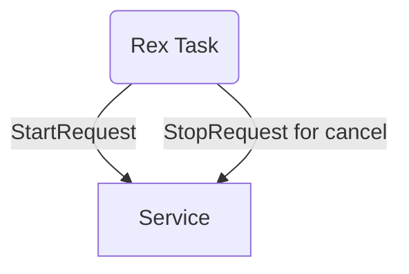
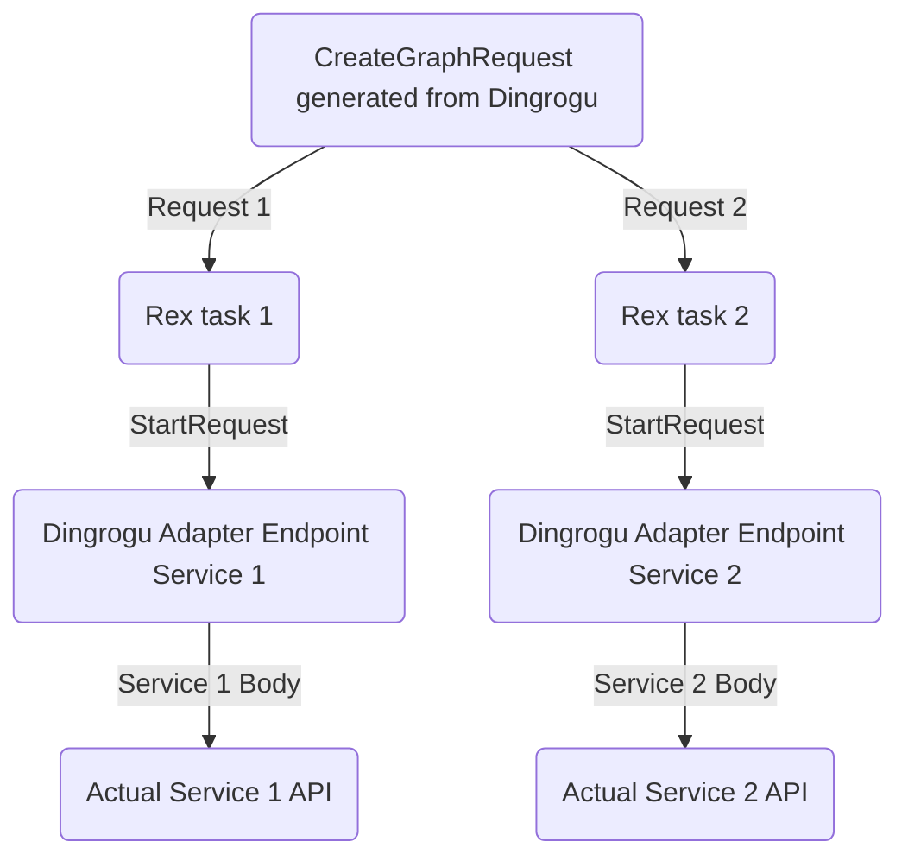
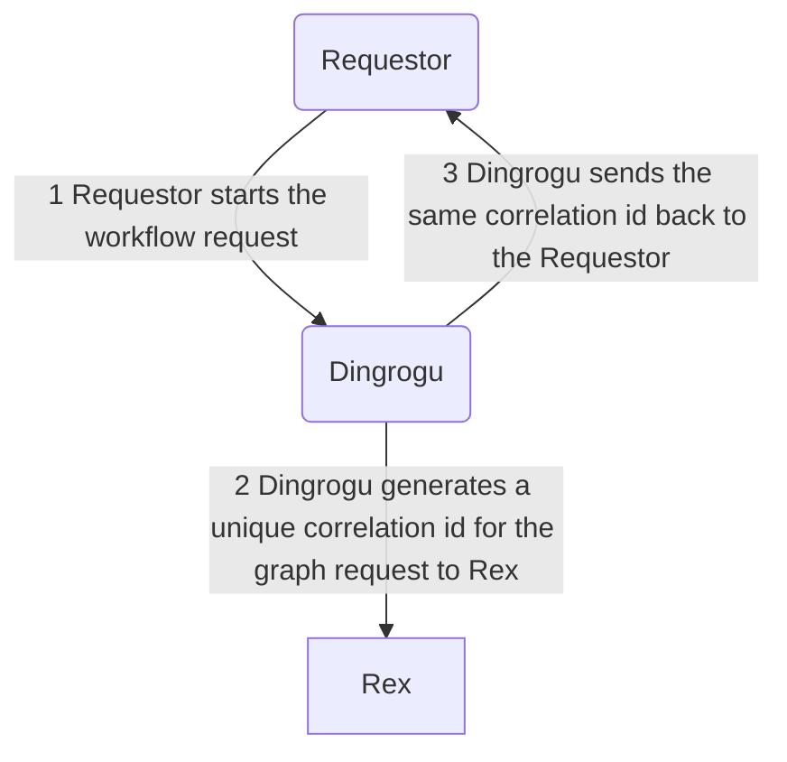
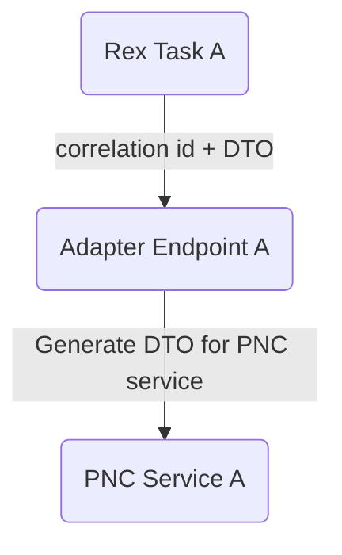
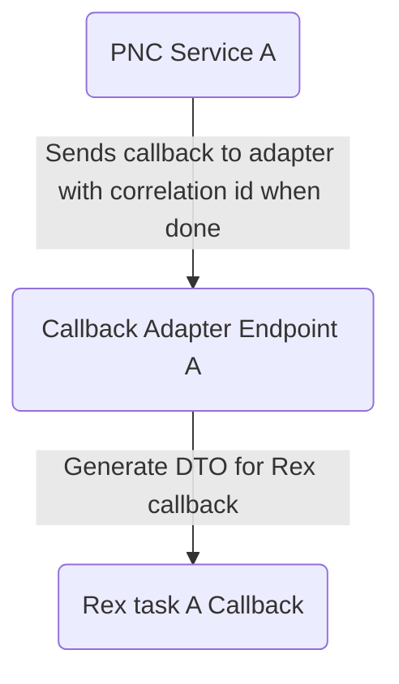

# dingrogu
test do not merge

The application configures workflows to run on [Rex](https://github.com/project-ncl/rex). A particular workflow can consist of multiple Rex tasks
interlinked together. Each Rex task represents a particular step that needs to be run to achieve the overall goal of the
workflow. Each Rex task will coordinate with a PNC service via Dingrogu's `adapter` endpoint.
The latter acts as the bridge between the Rex world (generic task coordinator with its own DTOs) and the PNC services.

We want to have workflows for:
- repository creation (talking with [Repour](https://github.com/project-ncl/repour))
- brew push (talking with [Causeway](https://github.com/project-ncl/causeway))
- build process (multiple applications)
- deliverables-analysis (talking with [Deliverables Analyzer](https://github.com/project-ncl/deliverables-analyzer/))

## Packaging and Running the application

You can run your application using:
```shell script
./mvnw clean install -DskipTests=true
java -jar application/target/dingrogu-runner.jar
```

The project is configured to build a uber-jar by default.

# Rex Tutorial
When creating the tasks to send to Rex, we'll create a graph request (aka `workflow` in Dingrogu) containing tasks, and
the dependencies between the tasks. Each graph request has its own unique correlation id.

## Task
Each task uses the `Request` DTO to tell Rex:

- an endpoint to start the request and its payload
- an endpoint to cancel the request and its payload
- the payload and headers and the HTTP method
- mdc values

The `Request` we define in the graph request gets transformed by Rex into:
- `StartRequest`
- `StopRequest`
DTOs before sending that DTO to the target service.

The `StartRequest` DTO contains:
- positiveCallback
- negativeCallback
- payload
- mdc map
- taskResults map (in case a task needs the result of a dependant task)
 


## Workflow
A workflow (Dingrogu term) is the set of tasks we need to run to coordinate a particular process, and the dependency
link between them to run the tasks in sequence. A workflow in Dingrogu is equivalent to the graph we'll send to Rex to
coordinate the tasks.



## Adapter Endpoint Purpose
Since Rex sends the `StartRequest` DTO to the targeted service, and none of the PNC services understands that DTO,
we need an adapter endpoint to translate the `StartRequest` DTO to the service's DTO.

This in turn requires the need to share enough information to the adapter endpoints to be able to send the right request.

# Coordination between workflow, adapter endpoint, and Rex
To be able to track the relationship between a particular workflow, the adapter endpoint, and Rex, we do the following:



When a requester sends a request to start a workflow, Dingrogru generates a unique correlation id and sends it back to
the requester. The requester can then use that id to cancel the workflow, or to track the progress of the workflow.

Dingrogu uses the same correlation id for the graph request it submits to Rex. This allows Dingrogu to forward any
future request from the requester for that workflow to Rex (like cancelling a workflow run).

Sending a request from a Rex task to the PNC service via the adapter


Receiving a callback result from PNC service to the Rex task via the adapter


## Endpoint Design

Workflow:
```
# Dingrogu returns the correlation id to the requestor
POST /workflow/<name>/start

# Get notification of state changes of tasks from Rex
POST /workflow/<name>/rex-notification

# Cancelling a workflow
POST /workflow/id/<correlation id>/cancel
```

Adapter:
```
# Start a task. The adapter will set the callback url for the service to the adapter callback endpoint
POST /adapter/<name of adapter task>/<correlation id>/start

# Callback from a PNC service to a task
POST /adapter/<name of adapter task>/<correlation id>/callback

# To cancel a specific task
POST /adapter/<name of adapter task>/<correlation id>/cancel
```

A specific adapter endpoint is implemented to only satisfy a specific Rex task.

# Architecture
This application consists of 2 parts:
- The creation of the workflow to send to Rex (`rest-workflow` module)
- An adapter part (`rest-adapter` module) that translates Rex's `StartRequest` and `StopRequest` (aka cancel) DTOs to
  the specific application DTO, as well as handling of callbacks from the application back to Rex

Rex, the adapter part, and how everything is interlinked together is explained in the following sections.

- `common` module holds any code that can be shared with different modules
- `api` module holds any DTOs and REST interfaces that could be used to generate both client and server code
- `rest-adapter` and `rest-workflow` modules are the REST server code that implements the REST interface.
- `application` module combines all the modules together to form the final Quarkus runner jar

The WorkflowEndpoint uses the implementations of the `Workflow` interface to generate the full graph request for Rex.
The `Workflow` implementations use the `Adapter` implementations to generate the specific Rex task DTO, then links the
Rex tasks together.

The WorkflowEndpoint is also designed to receive notifications of state changes of tasks from Rex. This can be used to:

1. Catch a task failure for a workflow (by reading the notification 'after' state) and report it back to the requester
   that the workflow has failed and a response object containing data on the failure
2. If a task notification reports a successful final state, check if all the other tasks are done. If so, report to the
   requester that the workflow has succeeded and send back the relevant data

The `Adapter` implementations are also used to handle the translation of Rex's `StartRequest` and `StopRequest` to the
specific PNC service.

Each Rex task has a corresponding `Adapter` implementation.

## Developing
1. Look into the `rest-workflow` module to start planning your tasks and how they connect to each other
2. Start working on your adapters in the `rest-adapter` module, figuring out what data you need for each request, and what clients you need
3. Wire the adapters together in the `rest-workflow` module
4. Profit!

## Future Rex features to explore
- Unique queue per workflow to have QoS and its own queue size
- Atomic running of group of tasks; if there's a failure, the group of tasks are run again
- Query Rex for the current state of affairs to get previous run data 
