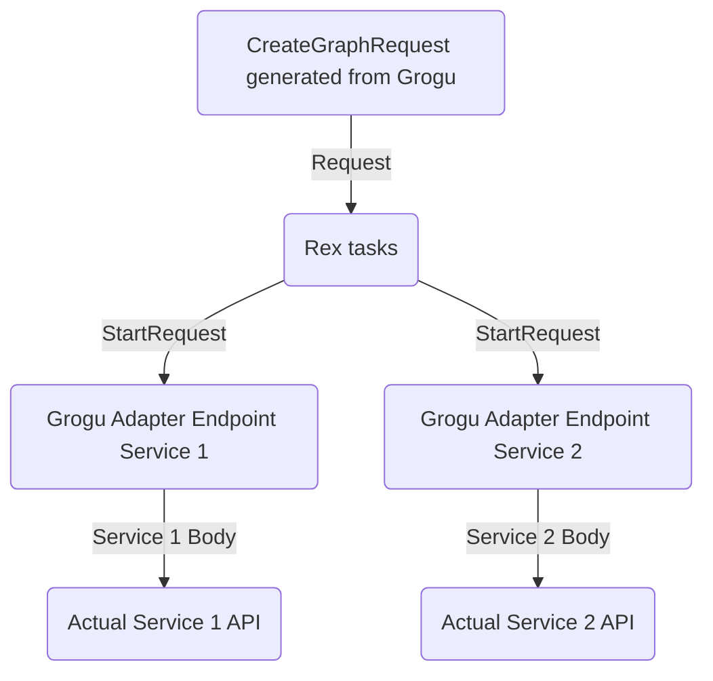

# dingrogu

The application configures workflows to run on [Rex](https://github.com/project-ncl/rex). A particular workflow can consists of multiple Rex tasks interlinked together. Those Rex tasks will then coordinate with our services via this application's `adapter` endpoints. The latter acts as the bridge between the Rex world (generic task coordinator) and PNC services.

We want to have workflows for:
- repository creation (talking with [Repour](https://github.com/project-ncl/repour))
- milestone release
- build process
- deliverables-analysis

## Packaging and Running the application

You can run your application using:
```shell script
./mvnw clean install -DskipTests=true
java -jar application/target/dingrogu-runner.jar
```

# House Rules
- We only use Jackson for JSON serialization

# Architecture
This application consists of 2 parts:
- The creation of the workflow to send to Rex (`rest-workflow` module)
- An adapter part that translates Rex's `StartRequest` and `StopRequest` DTOs to the specific application, as well as
handling of callbacks from the applications back to Rex

The adapter part is necessary to decouple Rex's particular DTO requests with the specific downstream's
application API.

The project is configured to build a uber-jar by default.

- `api` module holds any DTOs and REST interfaces that could be used to generate both client and server code
- `common` module holds any code that can be shared with different modules
- `rest-adapter` and `rest-workflow` modules are the REST server code that implements the REST interface.
- `application` module combines all the modules together to form the final Quarkus runner jar

## Workflow Creation
Rex requires that we specify for each task:
- an endpoint to start the request and its payload
- an endpoint to cancel the request and its payload
- mdc values

Rex then sends to the endpoint the `StartRequest` DTO which contains:
- positiveCallback
- negativeCallback
- payload
- mdc map
- taskResults map (in case a task needs the result of a dependant task)

# Rex Tutorial
When creating the tasks to send to Rex, we'll create a graph request containing tasks, and the dependencies between tasks.

The task uses the `Request` DTO to tell Rex:
- which service it needs to send the request
- the payload and headers and HTTP method

The `Request` we define in the graph request gets transformed into:
- `StartRequest`
- `StopRequest`

by Rex before sending the data to the service. The `Request` attachment becomes the `StartRequest` payload.


## Future Rex features to explore
- Unique queue per workflow to have QoS and its own queue size
- Atomic running of group of tasks; if there's a failure, the group of tasks are run again
- Query Rex for the current state of affairs to get previous run data 
