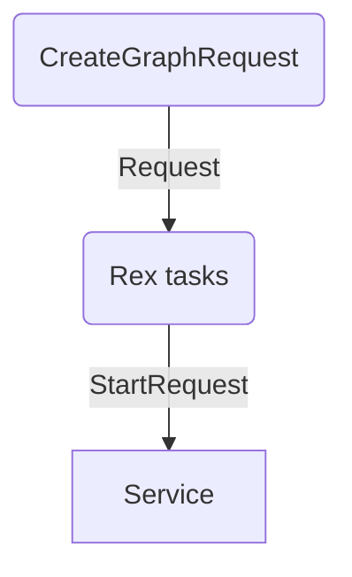
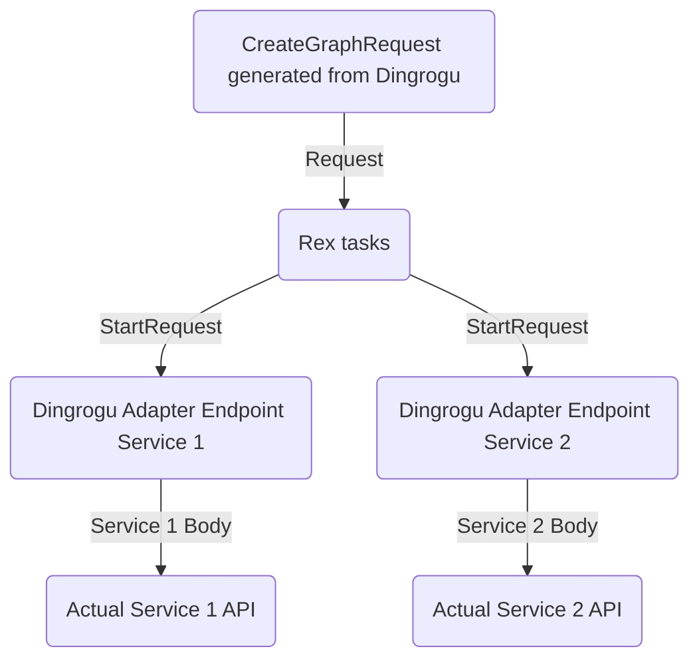
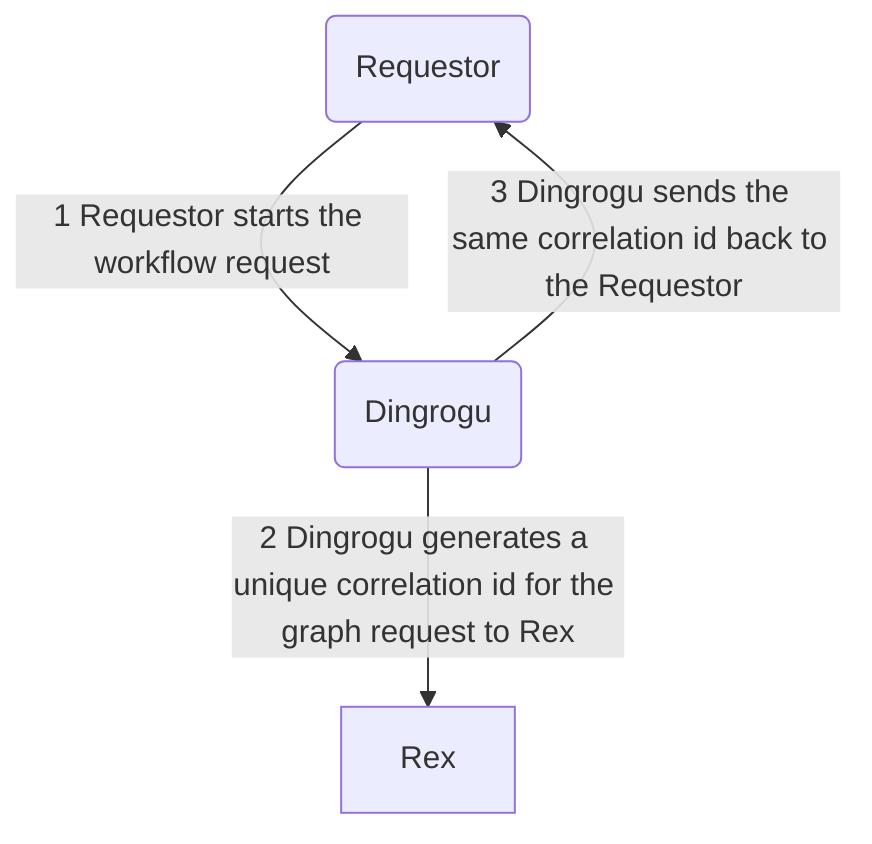
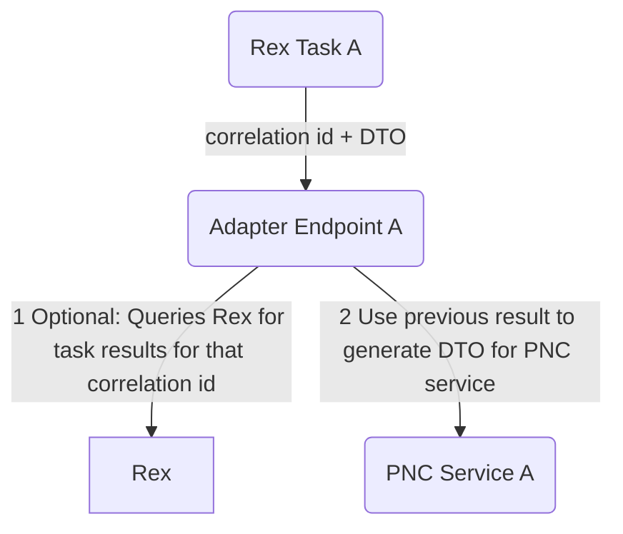
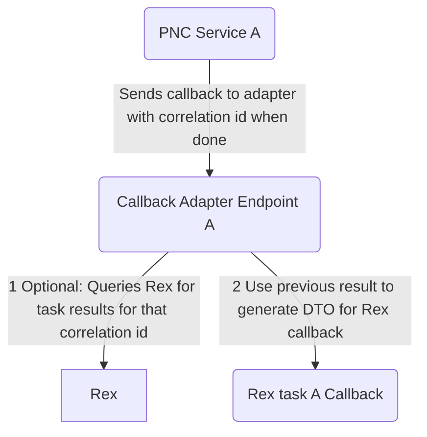

# dingrogu

The application configures workflows to run on [Rex](https://github.com/project-ncl/rex). A particular workflow can consists of multiple Rex tasks interlinked together. Those Rex tasks will then coordinate with our services via this application's `adapter` endpoints. The latter acts as the bridge between the Rex world (generic task coordinator) and PNC services.

We want to have workflows for:
- repository creation (talking with [Repour](https://github.com/project-ncl/repour))
- milestone release
- build process
- deliverables-analysis

## Packaging and Running the application

You can run your application using:
```shell script
./mvnw clean install -DskipTests=true
java -jar application/target/dingrogu-runner.jar
```

# House Rules
- We only use Jackson for JSON serialization

# Architecture
This application consists of 2 parts:
- The creation of the workflow to send to Rex (`rest-workflow` module)
- An adapter part that translates Rex's `StartRequest` and `StopRequest` (aka cancel) DTOs to the specific application, as well as
handling of callbacks from the applications back to Rex

Rex, the adapter part, and how everything is internlinked is explained in the following sections.

The adapter part is necessary to decouple Rex's particular DTO requests with the specific downstream's
application API.

The project is configured to build a uber-jar by default.

- `api` module holds any DTOs and REST interfaces that could be used to generate both client and server code
- `common` module holds any code that can be shared with different modules
- `rest-adapter` and `rest-workflow` modules are the REST server code that implements the REST interface.
- `application` module combines all the modules together to form the final Quarkus runner jar

# Rex Tutorial
When creating the tasks to send to Rex, we'll create a graph request containing tasks, and the dependencies between tasks. Each graph request has a unique correlation id.

The task uses the `Request` DTO to tell Rex:
- which service it needs to send the request
- the payload and headers and the HTTP method

The `Request` we define in the graph request gets transformed by Rex into:
- `StartRequest`
- `StopRequest`

DTOs before sending that DTO to the service. The `Request` attachment becomes the `StartRequest` payload.


## Workflow
A workflow is the set of tasks we need to run to coordinate a particular process, and the dependency link between them to run the tasks in sequence. This is equivalent to a BPM workflow if you are familar with BPM. A workflow in Dingrogu is equivalent to the graph we'll send to Rex to coordinate the tasks.


Rex requires that we specify for each task:
- an endpoint to start the request and its payload
- an endpoint to cancel the request and its payload
- mdc values

Rex then sends to the endpoint the `StartRequest` DTO which contains:
- positiveCallback
- negativeCallback
- payload
- mdc map
- taskResults map (in case a task needs the result of a dependant task)

Since Rex sends the `StartRequest` DTO to the targetted service, and none of the PNC service understands that DTO, we need an adapter endpoint to translate the `StartRequest` DTO to the service's DTO.

This in turn requires the need to share enough information to the adapter endpoints to be able to send the right request.

### Coordination between workflow, adapter endpoint, and Rex
To be able to track the relationship between a particular workflow, the adapter endpoint, and Rex, we do the following:



When a requestor sends a request to start a workflow, Dingrogru generates a unique correlation id and sends it back to the requestor. The requestor can then use that id to cancel the workflow, or to track the progress of the workflow.

Dingrogu uses the same correlation id for the graph request to Rex. This allows Dingrogu to forward any future request from the requestor for that workflow to Rex easily (like cancelling a workflow run).

This is also useful for the adapter endpoints: they will be provided with the correlation id for both the request and the callback, which they can potentially use to query Rex on the status of the different tasks for that correlation id.

Sending a request from a Rex task to the PNC service via the adapter


Receiving a callback result from PNC service to the Rex task via the adapter


## Endpoint Design

Workflow:
```
# Dingrogu returns the correlation id to the requestor
POST /workflow/<name>/start

# Cancelling a workflow
POST /workflow/<name>/cancel
```

Adapter:
```
# Start a task. The adapter will set the callback url for the service to the adapter callback endpoint
POST /adapter/<name of adapter task>/<correlation id>/start

# Callback from a PNC service to a task
POST /adapter/<name of adapter task>/<correlation id>/callback

# To cancel a specific task
POST /adapter/<name of adapter task>/<correlation id>/cancel
```

For now, a specific adapter endpoint is implemented to only satisfy a specific Rex task. We may change this in the future.


## Future Rex features to explore
- Unique queue per workflow to have QoS and its own queue size
- Atomic running of group of tasks; if there's a failure, the group of tasks are run again
- Query Rex for the current state of affairs to get previous run data 
