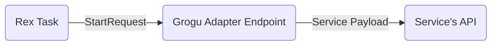

# Information

This package is used to hold any adapter REST endpoints. The latter is used to translate Rex's `StartRequest`
and `StopRequest` DTO to the service's API payload. The endpoint will do the DTO translation **and**
send the request to the service.

This is necessary to avoid deeply coupling Rex's DTOs to a service's API payload, and to ease migration from BPM to Rex.

All the endpoints **are** stateless and not dependent on the workflow endpoints.

## Concerns

One of the adapter concerns is to combine the `StartRequest` `payload` and `taskResults` fields into one cohesive DTO
that will be sent to the service.

Another concern might be on how to deal with the `positiveCallback` and the `negativeCallback` from Rex.

# Security
The authorization token from Rex to the adapter REST endpoints will be reused to send to the service's API after
translation. The translation of the 2 different DTOs shouldn't take a lot of time and therefore the token won't expire
during that period