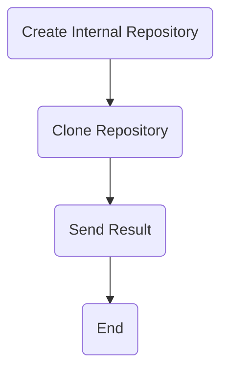
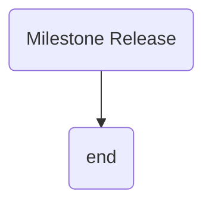

# Repository Creation

```mermaid
graph TD
    create-internal-repo(Create Internal Repository) --> clone-repository(Clone Repository)
    clone-repository --> send-result(Send Result)
    send-result --> finish(End)
```

# Milestone Release

```mermaid
graph TD
    milestone-release(Milestone Release) --> finish(end)
```

# Build Process
```mermaid
graph TD
    
```